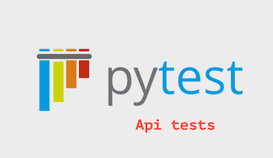

Python api tests

This is a tutorial project that shows how to implement api tests in Python

The project uses:

Python
Requests
Allure for reports
Docker

Testing application (write with Flask):

swagger: https://app.swaggerhub.com/apis/berpress/flask-rest-api/1.0.0

How to start
Use python 3.8 + Create and activate virtual environments

python3 -m venv env
source env/bin/activate
Run in terminal

pip install -r requirements.txt

Run all tests
pytest

Some requests require an authorization token. Use header like

"Authorization": "JWT {token}"
